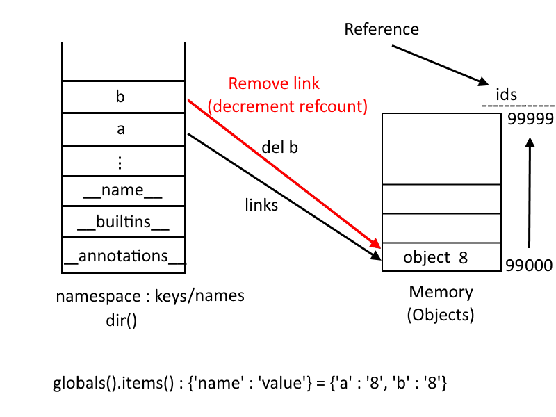

# Chapter_01: Introduction and Language Syntax.

Document's Author: Harmouch101

---

## Table Of Content <a name="TOC"></a>

1. [A Tutorial Introduction](#1)    
	1.1	[What is Python ?](#1.1)    
	1.2	[Why Python ?](#1.2)    
	1.3 [Interpreted Language](#1.3)    
2. [Running Python](#2)    
3. [Language Syntax](#3)    
	3.1	[Print Instruction](#3.1)   
	3.2	[Comments](#3.2)   
	3.3	[Variables](#3.3)    
	&nbsp;&nbsp;&nbsp;&nbsp;3.3.1 [Names](#3.3.1)     
	3.4	[literals](#3.4)    
	&nbsp;&nbsp;&nbsp;&nbsp;3.4.1 [String Literals](#3.4.1)    
	    &nbsp;&nbsp;&nbsp;&nbsp;&nbsp;&nbsp;&nbsp;&nbsp;3.4.1.1 [Special characters](#3.4.1.1)    
	&nbsp;&nbsp;&nbsp;&nbsp;3.4.2 [Numeric literals](#3.4.2)    
	[TODO]     
	.    
	.    
	.    

## 1. A Tutorial Introduction <a name="1"></a>

The goal of this chapter is to get you familiar with python 3 and its essential features.

## 1.1 What is Python ? <a name="1.1"></a>

Python is a high-level programming language that has the following features:
- It is designed to produce high quality, human-readable and maintainable code;
- Portable: Python is a cross-platform programming language, it can be used on Linux, Windows, macOS...;  
- Easy to integrate code;
- Object-Oriented programming language;
- Completely Free;
- Highly Productive: A program written in Python is typically 2 to 4 times shorter than an equivalent C++ program;
- Dynamic: the source code is not compiled unlike other languages ​​like C, C++, java, but executed on the fly. It is called an interpreted language;

## 1.2 Why Python ? <a name="1.2"></a>

Python is a good programming language to start with for a beginner who doesn't know programming at first. Python is very powerful and it is used in a lot of domains. The following list describes the different areas in which Python is mostly used:

- System Administration: System administrators often need to design small programs to automate certain tasks. Therefore the usage of python because it is simpler and more direct;
- Rapid Prototyping: There are a lot of softwares powered by python that allows you to build graphical user interfaces which can be useful for performing specification cycles between clients and the development team. Qt designer is a good example of that;
- Scientific Research: Python is much easier to learn for a researcher who does not have the knowledge of programming. Memory management, the use of pointers, the typing of variables, and all the details of the implementation of a program are all constraints that are far away from the first concerns of a researcher;
- Web Applications: A lot of web frameworks, written in Python(e.g. Twisted, Django ...) are very popular and active which allows python to the forefront of the scene in web development.

## 1.3 Interpreted Language <a name="1.3"></a>

Python commands and instructions are executed by the interpreter, which is written in C language and has different implementations like :
- CPython: C implementation, which is the default implementation of Python;
- Jython: Java implementation, which allows you to run Python source code in a Java environment, and use Java modules in Python code transparently; 
- PyPy: Python implementation of the Python language;
- IronPython: implementation for .NET and Mono;
- Stackless Python: a variant of CPython, slightly faster.

## 2. Running Python <a name="2"></a>

You can run the interpreter by simply entering the 'Python3' command in your terminal :

```sh
~$ python3 
```

```python
Python 3.7.6 (default, Jan  8 2020, 19:59:22) 
[GCC 7.3.0] :: Anaconda, Inc. on linux
Type "help", "copyright", "credits" or "license" for more information.
>>> 
```

As you can see, the interpreter displays its python version, the compiler version and the copyright message and it is listening for statements from the user.

One of the most useful features in python is the interaction mode(shell), which allows the user to do operations and see results immediately on the shell.

```python
>>> 699120 + 20958 - 1932
718146
>>> _ 

718146
```

The **_** variable in python holds the result of the previous operation.
you could run your own program(script) in a file and name it with the extension **'.py'** and execute it on the shell without the usage of interactive mode.

```python
# hi.py
print('Hi There!')
```

```bash
~$ python3 hi.py
Hi There!
```

In a Linux distro, you can add at the first line of your program the following line to make the file executable on the shell :

```python
#!/usr/bin/env python3 # must be at the first line or you'll get a syntax error 
# hi.py
print('Hi There!')
```

To make it executable, just give the user the execution privileges using the following

```bash
~$ chmod u+x hi,py 
```

Now you can run the executable file like the following:

```sh
~$ ./hi.py
Hi There!
```

Back to the interpreter, you can exit it by pressing `Ctrl + D` which signal the interpreter an end of the file command, or by raizing a system exit exception as follows:

```python
>>> raise SystemExit() 
```

```sh
~$ 
```

you can also use the `exit()` method to exit the interactive prompt, aka the Read Eval Print Loop (REPL).


## 3. Language Syntax <a name="3"></a>

## 3.1 Print Instruction <a name="3.1"></a>

```python
>>> print("Hi There!")
Hi There!
>>> print(5)
5
>>> print(4 * 4)
16
>>> print(109 + 15 + 100)
224
>>> print("text goes here!")
text goes here!
>>> print(("text", "goes", "here!"))
('text', 'goes', 'here!')
>>> print(text goes here!)
  File "<stdin>", line 1
    print(text goes here!)
                  ^
SyntaxError: invalid syntax
>>> 
```

## 3.2 Comments  <a name="3.2"></a>

In Python, you can use the hash sign (#) to place comments on a single line.

```python
# first comment
print ("Hi There!") # second comment on the same line of the statement. 
# third comment
# fourth one is the best
```
These comments are ignored by the interpreter which considers, in this case, the `)` symbol as the end of the print statement, except when it is linked to the next line by the backslash character `\` as the following example shows:

```python
>>> print("text goes \
...     here!")
text goes       here!
>>> print("text goes \ # you can't insert a comment here!!!!!
  File "<stdin>", line 1
    print("text goes \ # you can't insert a comment here!!!!!
                                                       ^
SyntaxError: EOL while scanning string literal

```

## 3.3 Variables <a name="3.3"></a>

Python's Variables are object-based. Each object has :

- **An Identifier**: It is a positive unique integer that is created once for all when the object is being created. It is calculated from the object's memory address.

- **A Type**: The type of the object is immutable. you cannot change it during the runtime.

- **A Value**: The value assigned to the object can be modified depending on the type of the object. For instance, string and tuple type objects cannot be modified after their creation. They are called immutable objects.

- **Attributes**: properties of the object.

- **Name**: an object must have a name.

- **One or more base classes**

The following callable objects allow you reading each of the attributes described:

- **id ()**: returns the identifier of an object;

- **type ()**: returns the type of an object;

- **dir ()**: lists all the features of an object.

So as it is said before, Everything in python, at the runtime, is an object.

```python
>>> 32, id(32), type(32)
(32, 94140309858016, '<class 'int'>')
>>> 32, id(32), type(32)
(32, 94140309858016, '<class 'int'>')
>>> 32, id(32), type(32)
(32, 94140309858016, '<class 'int'>')
```

Every object has a **value**(32 here), an id which is used to indicate where it is stored in memory(94140309858016) and a data type(integer).

It is not convenient to use the identifier(id) as a name for the 32 value, Hence the need for assignments.

An assignment is made using the `=` symbol, like this:

```python
>>> a = 32
>>> a,id(a),type(a)
(32, 94140309858016, '<class 'int'>')
```

Notice that the object **name** `a` has the same reference of object 32(id = 94140309858016).

The object name `a` has the following **attributes** :

```python
>>> dir(a)
['__abs__', '__add__', '__and__', '__bool__', '__ceil__', '__class__', '__delattr__', '__dir__', '__divmod__', '__doc__', '__eq__', '__float__', '__floor__', '__floordiv__', '__format__', '__ge__', '__getattribute__', '__getnewargs__', '__gt__', '__hash__', '__index__', '__init__', '__init_subclass__', '__int__', '__invert__', '__le__', '__lshift__', '__lt__', '__mod__', '__mul__', '__ne__', '__neg__', '__new__', '__or__', '__pos__', '__pow__', '__radd__', '__rand__', '__rdivmod__', '__reduce__', '__reduce_ex__', '__repr__', '__rfloordiv__', '__rlshift__', '__rmod__', '__rmul__', '__ror__', '__round__', '__rpow__', '__rrshift__', '__rshift__', '__rsub__', '__rtruediv__', '__rxor__', '__setattr__', '__sizeof__', '__str__', '__sub__', '__subclasshook__', '__truediv__', '__trunc__', '__xor__', 'bit_length', 'conjugate', 'denominator', 'from_bytes', 'imag', 'numerator', 'real', 'to_bytes']
>>> a.__str__()
'32'
```
Notice that the private (`__`) **attribute** 'str' hold the value of a as string.

Let's take the following example :

```python
>>> b = a * 3
>>> b,id(b),type(b)
(96, 94140309860064, '<class 'int'>')
>>> a,id(a),type(a)
(32, 94140309858016, '<class 'int'>')
```

the interpreter takes the expression at the right side of the assignment symbol **=** and evaluates it. As a result, an object of type integer whose value is 96 is created and stored in memory and the reference of that object is assigned to b. Note that, the value of this particular object is already stored in memory. 

```python
>>> 96,id(96),type(96)
(96, 94140309860064, '<class 'int'>')
```

I think, in this particular example, the Python interpreter didn't create a new object of value `96` in memory(because it is already stored at that id for optimization porpuses), it changes the reference of b only. This is only true because 32 is between -5 and 256.

From [python C-API documentation](https://docs.python.org/3/c-api/long.html), I found the following explanation: 

>The current implementation keeps an array of integer objects for all integers between -5 and 256, when you create an int in that range you actually just get back a reference to the existing object. So it should be possible to change the value of 1. I suspect the behavior of Python, in this case, is undefined. :-)

let's try it for a number larger than 256 :

```python
>>> b = 257
>>> id(b)
140086582008304
>>> id(257)
140086582008272
```

So as you can see, b and 257 are different objects in memory.
Now lets create a variable and increment it and see how much it takes space in memory:

```python
>>> a = 0
>>> a += 1
>>> a,id(a),type(a)
(1, 94140309857024, '<class 'int'>')
>>> a += 1
>>> a,id(a),type(a)
(2, 94140309857056, '<class 'int'>')
>>> a += 1
>>> a,id(a),type(a)
(3, 94140309857088, '<class 'int'>')
```

The id increments by 32(i found some cases on the internet where the id has increased by 16, maybe because it was a 32-bit architecture), my computer is 64 bits address space, so i think each object in python is stored on 32 bytes if you have a 64 bit machine.

you can assign one object to several variables simultaneously.

```python
>>> a = b = 8
>>> id(a),id(b)
(94232164422624, 94232164422624)
```

Notice that a and b point to the same object address in memory.

you could assign multiple values to multiple variables at the same time.

```python
>>> a, b = 32, 64
```

In python, objects are destroyed automatically(not explicitly) from memory by the garbage collector, which keeps a reference counter for each object. This field is incremented by one if other objects reference a given object. An example where this variable increases :

- assignment operator
- passing arguments
- inserting a new object into the list (the number of links for the object increases)
- a constructor like foo = bar (foo starts referring to the same object as bar)
 If this referencing(link) is destroyed, then the reference counter will decrease by one. If the reference counter reaches 0, then the interpreter starts the mechanism of destroying the object.

 The reference counter of global variables never drops to zero.

```python
>>> a = 8
>>> sys.getrefcount(a)
2
>>> b = a
>>> sys.getrefcount(a)
3
>>> del b
>>> sys.getrefcount(a)
2
```



## 3.3.1 Names <a name="3.3.1"></a>

Names are attached, as we saw previously, to objects. The following method shows the names that are stored in the namespace:

```python
>>> dir()
['__annotations__', '__builtins__', '__doc__', '__loader__', '__name__', '__package__', '__spec__']

```

When you create a new object and give it a name, this name is stored in the namespace:

```python
>>> a = 16
>>> dir()
['__annotations__', '__builtins__', '__doc__', '__loader__', '__name__', '__package__', '__spec__', 'a']
```

You can write a function that returns an object's name and value pair stored in the namespace as a dictionary:

```Python
>>> def names_values():
...     obj = []
...     for (name,value) in globals().items():
...             if not name[:2] == '__':
...                     obj.append((name,value))
...     return dict(obj)
... 

```

globals().items() returns a tuple of names and values.
dir() returns only the name(key)

```Python
>>> names_values()
{}
>>> a = 8
>>> b = 16
>>> c = a
>>> names_values()
{'a': 8, 'b': 16, 'c': 8}
>>> del c
>>> names_values()
{'a': 8, 'b': 16}
```

So it is all about storing and deleting names from the namespace. As it is said previously, the object will be destroyed from memory if the refcount reaches zero. So the object 8 won't be destroyed because it is also referenced by the name `a`.

## 3.4 Literals <a name="3.4"></a>

A literal in python is the simplest way to create an object, but at the same time it can be a constant, but which does not mean objects. A variable is assigned at the runtime, whereas a literal is assigned at the compile time.

```python
>>> 1 	# numeric literal
1
>>> "here goes a string" 	# string literal
'here goes a string'
>>> [1,2,3]		# list literals
[1, 2, 3]
>>> {'k0':1,'k1':2, 'k3':3}		# dict literal
{'k0': 1, 'k1': 2, 'k3': 3}
```

But this is not useful if you want to manipulate these values without assigning it to a variable. Hence the need for the assignment.

```python
>>> a = 8
```

Here the object whose name is 'a' is created by the numerical literal 8. So, on the left side, we have the variable name and on the right, we have the literal.
To see the difference between the built-in functions and the literals, you can create a list in two different ways :

```python
>>> a = list([1,2,3]) 	# creating a list using a built-in function
>>> a = [1,2,3]		# creating a list using a list literal
```
### 3.4.1 String Literals <a name="3.4.1"></a>

Strings are alphanumeric(text constant) values ​​surrounded by quotes. Single or double quotes, or even three single or double-quotes.

```python
>>> print("here we have a one-line string with one double quote")
here we have a one-line string with one double quote
>>> print('here we have a one-line string with one single quotes')
here we have a one-line string with one single quote
>>> print("""here we have multiple lines
...     string with three double quotes""")
here we have multiple lines
        string with three double quotes
>>> print('''here we have multiple lines
...     string with three single quotes''')
here we have multiple lines
        string with three single quotes
```

It is also possible to prefix strings with a character:
-  **r** or **R** : "raw string" :used with regular expressions and with strings that contain backslashs :

```python
>>> print('D:\files\file1')
D:
  iles
      ile1
>>> print(r'D:\files\file1')
D:\files\file1
```

It seems like`\f` act as a new line with tabulation: `\n\t`, in other terms a vertical tabulation.

- **u** or **U** : to indicate a Unicode string. Python 3 adopts the base Unicode standard, and the u prefix disappears.

```python
>>> unicode = u'i am a unicode string'
>>> unicode
'i am a unicode string'
>>> type(unicode)
<class 'str'>
```

- **b** or **B**: to indicate a byte string. Each byte in a byte string corresponds to a certain value in the range of [0; 255].

```python
>>> b'hi there'
b'hi there'
>>> b'hi there'[3]
116
```

Encoding and decoding methods make it possible to convert from type str to type bytes, using a correspondence table, called codec and having a unique name(UTF-8 is used in the example).

```python
>>> string = 'this is string'
>>> byte_string = string.encode('UTF-8') 	# from str to bytes
>>> byte_string
b'this is string'
>>> decoded_string = byte_string.decode('UTF-8') 	# # from bytes to str
>>> decoded_string
'this is a string'
```
- **f** or **F**: this prefix has been added since python 3.6 which allows you to define a string as formatted. So using this prefix, you can add a placeholder for a certain variable with the help of curly braces `{}` to indicate the appearance of this variable(e.g. precision of a number to display).

```python
>>> from math import cos, pi
>>> print(f'Value of PI with 4 digit precision: {pi:+1.4}')
Value of PI with 4 digit precision: +3.1416
>>> for i in range(1,20):
...     x = cos(pi/i)
...     print(f'|i = {i:<2}| cos(pi/{i:<2}) = {round(x,2):<+5.2}|') 
... 	# < indicates left alignement; ^ for center alignment; > for right alignment;
...		#  the number after the synbol < indicate the width of the column to display
... |  |       |  |  |     |
... |..|       |..|  |.....|
|i = 1 | cos(pi/1 ) = -1.0 |
|i = 2 | cos(pi/2 ) = +0.0 |
|i = 3 | cos(pi/3 ) = +0.5 |
|i = 4 | cos(pi/4 ) = +0.71|
|i = 5 | cos(pi/5 ) = +0.81|
|i = 6 | cos(pi/6 ) = +0.87|
|i = 7 | cos(pi/7 ) = +0.9 |
|i = 8 | cos(pi/8 ) = +0.92|
|i = 9 | cos(pi/9 ) = +0.94|
|i = 10| cos(pi/10) = +0.95|
|i = 11| cos(pi/11) = +0.96|
|i = 12| cos(pi/12) = +0.97|
|i = 13| cos(pi/13) = +0.97|
|i = 14| cos(pi/14) = +0.97|
|i = 15| cos(pi/15) = +0.98|
|i = 16| cos(pi/16) = +0.98|
|i = 17| cos(pi/17) = +0.98|
|i = 18| cos(pi/18) = +0.98|
|i = 19| cos(pi/19) = +0.99|

```

So as you can see, the `f` prefix is so much handy and useful. Alignment is done using one of the following characters:

| Character | Description | Example | 
| --- | --- | --- | 
| `<` | align the object to the left. | `>>> print(f"[{'left alignement':<32}]")`<br>`[left alignement                 ]`<br>`>>> print(f"[{'left':<<16}]")`<br>`[left<<<<<<<<<<<<]` | 
| `>` | align the object to the right. | `>>> print(f"[{'right alignement':>32}]")`<br>`[                right alignement]`<br>`>>> print(f"[{'right':>>16}]")`<br>`[>>>>>>>>>>>right]` |
| `^` | align the object to the center. | `>>> print(f"[{'center alignement':^32}]")`<br>`[       center alignement        ]`<br>`print(f"|{'center':^^16}]")`<br>`[^^^^^center^^^^^]` |


The sign option is used only for numbers with the following values:

| Character | Description | Example |  
| --- | --- | --- | 
| `+` | the sign `-` and `+` will be used for all numbers. | `>>> print(f"[{+32:^+5}]")`<br>`[ +32 ]` |
| `-` | `-` for negative numbers and nothing will be displayed otherwise. | `>>> print(f"[{+32:^-5}]")`<br>`[ 32  ]` |
| `Space` | `-` for negative numbers and whitespace for positives. | `>>> print(f"[{+32:^ 5}]")`<br>`[  32 ]` |
| `=` | Forces the padding to be placed after the sign (`+` or `-`) but before the digits. | `>>> print(f"[{+32:0=+5}]")`<br>`[+0032]`<br>`>>> print(f"[{+32:^=+10}]")`<br>`[+^^^^^^^32]` |


### 3.4.1.1 String Formatting <a name="3.4.1.1"></a>

There are three methods in python that can be used to format strings:

- Using the **%** modulo sign with one of the following values:

| %type | Description | Example | 
| --- | --- | --- | 
| `%d`,`%i`,`%u` | signed decimal, signed integer and unsigned decimal. | `>>> print("%d + %i = %u"%(10,15,10+15))`<br> 10 + 15 = 25 |


### 3.4.1.2 Special characters <a name="3.4.1.2"></a>

Python allows you to insert special characters in a string literal. the following table contains a list of spetial characters:

| \Character | Description | Example |
| --- | --- | --- |
| `\'`, `\"` | insert a single or double quote in a string literal. | `>>> print("python\'s notes")` <br>python's notes |
| `\n` | insert a new line | `>>> print("that's\r\nnice!")`<br>that's nice! |
| `\r\n`, `\r` | insert a new line in windows, \r on Mac, end of line character(EOL). | `>>> print("that's\r\nnice!")`<br>that's nice! |
| `\\` | insert a single backslash in a string literal. | `>>> print("The file is in D:\\files\\file1")`<br>The file is in D:\files\file1 |
| `\v` | insert a vertical tabulation. | `>>> print("This is a vertical\v tabulation")`<br>This is a vertical<br>tabulation |
| `\t` | insert a Horizontal tabulation(tab). | `>>> print("This is a horizontal\t tabulation")`<br>This is a horizontal&nbsp;&nbsp;&nbsp;&nbsp;&nbsp;&nbsp;&nbsp;&nbsp;tabulation |
| `\b` | erase/delete a previous character from a string literal. | `>>> print("the last letter will be erased\bd")`<br>the last letter will be erased |
| `\Oct` | insert an octal value of a character. | `>>> print("\110i There!")`<br>Hi There!` |
| `\xHx` | insert an hexadecimal value of a character. | `>>> print("\x48i There!")`<br>`Hi There! |
| `\N{noun}` | insert a charater defined by a noun. | `>>> print('\N{dollar sign}')`<br>$<br>`>>> print('\N{pound sign}')`<br>£ |

Please refer to [this link](http://www.asciitable.com/) if you want to search for ASCII characters.


### 3.4.2  Numeric literals <a name="3.4.2"></a>

There are three types of numeric literals to represent values:
- integers;
- Floating points;
- Complex numbers.


