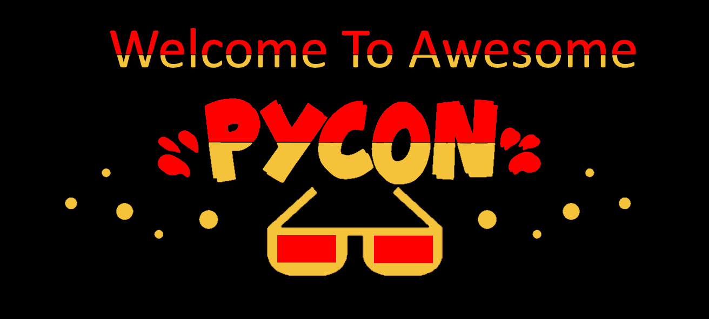

<!-- MIT License

Copyright (c) 2022, Harmouch101
All rights reserved.
 -->

<!--     
        
     --> 
    
        <h1>😎 Awesome Pycon!</h1>
    

    
     

## Simple Summary

A collection of notes, speaker's slides deck, files related to pycon talks, and a list of handful python books I read and/or am currently reading. This repository can be used as a reference/documentation for mastering the python programming language and the Django framework.

> ⚠️ This repo is currently under construction. Consider giving a ⭐ for future updates!    

> If you are looking for a way to contribute to the project, please refer to the [`Guideline`][00].  

> Currently maintained by [`Mahmoud Harmouch`][01].  

## 💪 Motivation

In the last couple of years, many of us have gone through challenging moments in many different ways, both physically and mentally. And in time of need, `Pycon` was already there playing the role of a spiritual leader, helping us make the time pass by faster, easier with joy. Consequently, we need to come together to form a small community within a hobby that would add value for our and subsequent generations and make it easier to learn python related content by sharing notes.

In my honest opinion, information must be free of charge and easily accessible for all kinds of people around the globe. Given the fact that the `Pycon` content is already out there for free, I realized that it is a bit harder to locate the slides associated with a given video. Hence, we should have a centralized place where you can easily access the slide decks without a hustle, going after many google searches. 

This repository serves three primary roles:

1. Sharing my own notes of what I learned while watching the conference on YT.

2. Creating backup storage for each speaker's files and slide decks.

3. Sharing a handful list of books that can play a significant role in honing your python skills. 

## 📜 Requirements:

<b>Python 3.6 +.</b>

## 👉 Table Of Content (TOC). 

1. [Python Talks](#Talks)   

    1.1 [Novice Level - Core](#Novice)   
    &nbsp;&nbsp;&nbsp;&nbsp;1.1.1 [Stuart Williams - Python Epiphanies](#1.1.1)   
    &nbsp;&nbsp;&nbsp;&nbsp;1.1.2 [Trey Hunner - Hands-On Intro to Python](#1.1.2)   
    &nbsp;&nbsp;&nbsp;&nbsp;1.1.3 [Jessica McKellar - Hands-on intro to Python](#1.1.3)   

    1.2 [Intermediate Level - Core](#Intermediate)   
    &nbsp;&nbsp;&nbsp;&nbsp;1.2.2 [Luciano Ramalho - Pythonic Objects](#1.2.1)   
    &nbsp;&nbsp;&nbsp;&nbsp;1.2.2 [Luciano Ramalho - Pythonic APIs](#1.2.2)   
    &nbsp;&nbsp;&nbsp;&nbsp;1.2.3 [Luciano Ramalho - Decorators & Descriptors](#1.2.3)   
    &nbsp;&nbsp;&nbsp;&nbsp;1.2.4 [Trey Hunner - Lazy Looping in Python](#1.2.4)    
    &nbsp;&nbsp;&nbsp;&nbsp;1.2.5 [Trey Hunner - List Comprehensions & Generator](#1.2.5)   
    &nbsp;&nbsp;&nbsp;&nbsp;1.2.6 [Trey Hunner - Readable Regular Expressions](#1.2.6)  

    1.3 [Fun To Watch](#Fun)   
    &nbsp;&nbsp;&nbsp;&nbsp;1.3.1 [David Beazley - Discovering Python](#1.3.1)   
    &nbsp;&nbsp;&nbsp;&nbsp;1.3.2 [David Beazley - The Fun of Reinvention](#1.3.2)   
    &nbsp;&nbsp;&nbsp;&nbsp;1.3.3 [David Beazley - Fear and Awaiting in Async](#1.3.3)   
    &nbsp;&nbsp;&nbsp;&nbsp;1.3.4 [David Beazley - Built in Super Heroes](#1.3.4)   

    1.4 [Python 2 and Python 3](#2to3)   
    &nbsp;&nbsp;&nbsp;&nbsp;1.4.1 [Brett Cannon - Python 3.3 is Better than  Python 2.7](#1.4.1)   
    &nbsp;&nbsp;&nbsp;&nbsp;1.4.2 [Brett Cannon - How to make your code Python 2/3 compatible](#1.4.2)  

    1.5 [DSA, Algorithms](#Algorithms)   
    &nbsp;&nbsp;&nbsp;&nbsp;1.5.1 [Brandon Rhodes - Data Structures in the Std Lib](#1.5.1)   
    &nbsp;&nbsp;&nbsp;&nbsp;1.5.2 [Justin Abrahms - Computer Science Fundamentals](#1.5.2)   

    1.6 [DevOps](#DevOps)   

    1.6 [Full-Stack](#Full)   

2. [My Notes/Book](#Notes)   

    2.1 [Chapter-01: The Language Basics](#chapter1)   
    2.2 [Chapter-02: Built-In functions and the Std-Modules](#chapter2)  

3. [Python Books](#Books)   

    3.1 [Novice Level](#books3.1)    
    &nbsp;&nbsp;&nbsp;&nbsp;3.1.1 [Head-First Python: A Brain-Friendly Guide
](#books3.1.1)   
    &nbsp;&nbsp;&nbsp;&nbsp;3.1.2 [Python for Everybody: Exploring Data in Python 3](#books3.1.2)   
    &nbsp;&nbsp;&nbsp;&nbsp;3.1.3 [Learn Python 3 the Hard Way](#books3.1.3)   
    &nbsp;&nbsp;&nbsp;&nbsp;3.1.4 [Python Programming for the Absolute Beginner](#books3.1.4)   
    &nbsp;&nbsp;&nbsp;&nbsp;3.1.5 [Introduction to Computation and Programming Using Python](#books3.1.5)   
    &nbsp;&nbsp;&nbsp;&nbsp;3.1.6 [Python Programming: An Introduction to Computer Science](#books3.1.6)   
    &nbsp;&nbsp;&nbsp;&nbsp;3.1.7 [Python Crash Course](#books3.1.7)   
    &nbsp;&nbsp;&nbsp;&nbsp;3.1.8 [Python for Kids](#books3.1.8)   
    &nbsp;&nbsp;&nbsp;&nbsp;3.1.9 [Core Python Programming](#books3.1.9)   
    &nbsp;&nbsp;&nbsp;&nbsp;3.1.10 [Programming Python](#books3.1.10)   
    &nbsp;&nbsp;&nbsp;&nbsp;3.1.11 [Learning Python](#books3.1.11)    
    &nbsp;&nbsp;&nbsp;&nbsp;3.1.12 [Think Python](#books3.1.12)   

    3.2 [Intermediate Level](#books3.2)    
    &nbsp;&nbsp;&nbsp;&nbsp;3.2.1 [Murach's Python Programming](#books3.2.1)    
    &nbsp;&nbsp;&nbsp;&nbsp;3.2.2 [Python Cookbook](#books3.2.2)   
    &nbsp;&nbsp;&nbsp;&nbsp;3.2.3 [Effective Python: 59 Specific Ways to Write Better Python](#books3.2.3)   
    &nbsp;&nbsp;&nbsp;&nbsp;3.2.4 [Python Tricks: A Buffet of Awesome Python Features](#books3.2.4)   
    &nbsp;&nbsp;&nbsp;&nbsp;3.2.5 [Intermediate Python](#books3.2.5)   
    &nbsp;&nbsp;&nbsp;&nbsp;3.2.6 [Python 3 Object Oriented Programming](#books3.2.6)   
    &nbsp;&nbsp;&nbsp;&nbsp;3.2.7 [Problem Solving with Algorithms and Data Structures Using Python](#books3.2.7)   
    &nbsp;&nbsp;&nbsp;&nbsp;3.2.8 [Practices of the Python Pro](#books3.2.8)   

    3.3 [Reference](#books3.3)   
    &nbsp;&nbsp;&nbsp;&nbsp;3.3.1 [Fluent Python](#books3.3.1)   
    &nbsp;&nbsp;&nbsp;&nbsp;3.3.2 [Mastering Python High Performance](#books3.3.2)   
    &nbsp;&nbsp;&nbsp;&nbsp;3.3.3 [Python Testing with pytest](#books3.2.3)   

## 📺 Python Talks 

#### 🔝 [Go To TOC](#TOC). 

### 1.1 Novice Level   

|  Video Title | YT Links   |  Duration     | Speaker Deck  | Backup files |
| :---: | :------------:      | :------------:     |  :------------:     | :------------: |
| Python Epiphanies   | [`2014`][000] [`2016`][001] [`2017`][002] [`2018`][003] |  `3:17:08` |  [`2015`][0000] [`2016`][0001] [`2018`][0002] | [`Mega`][00000] |
| Hands-On Intro to Python   | [`2017`][010] |  `3:26:03` |  [`2017`][0100]| --- |
| Hands-on Intro to Python For Beginning Programmers  | [`2014`][020] |  `3:21:49` |  --- | --- |

### 1.2 Intermediate Level    

|  Video Title | YT Links   |  Duration   | Speaker Deck  | Backup files |
| :---: | :------------:      | :------------:     | :------------:     | :------------: |
| Pythonic Objects   | [`2019`][110] | `3:22:14` | [`2014`][1100] [`Github`][1101] | [`Mega`][11000] |
| Pythonic APIs   | [`2016`][120] | `3:01:52` | [`2016`][1200] [`Github`][1201] | [`Mega`][12000] |
| Decorators & Descriptors   | [`2017`][130] |  `2:55:02` | [`2017`][1300] | [`Mega`][13000] |
| Lazy Looping in Python   | [`2019`][140] |   `3:22:14` | [`2017`][1400] | --- |
| List Comprehensions & Generators   | [`2018`][150] |  `3:21:43` |  [`2017`][1500] | --- |
| Readable Regular Expressions   | [`2016`][160] [`2017`][161] [`2021`][162] |  `3:19:43` |  [`2016`][1600] [`2017`][1601] [`2021`][1602] | --- |

### 1.3 Fun To Watch    

|  Video Title | YT Links   |  Duration   | Speaker Deck  | Backup files |
| :---: | :------------:      | :------------:     | :------------:     | :------------: |
| Discovering Python   | [`2014`][210] |  `00:47:49` |  [`2014`][2100] |[`Mega`][21000] |
| The Fun of Reinvention   | [`2017 - Screencast`][220] [`2017`][221] |  `00:55:21` |  [`2017`][2200] |[`Mega`][22000] |
| Fear and Awaiting in Async   | [`2016 - Screencast`][230] [`2016`][231] | `00:56:42` |  [`2016`][2300] | [`Mega`][23000] |
| Built in Super Heroes   | [`2016 - Screencast`][240] [`2016`][241] |  `00:44:31` | [`2016`][2400] | [`Mega`][24000] |

### 1.4 Python 2 and Python 3    

|  Video Title | YT Links   |  Duration   | Speaker Deck  | Backup files |
| :---: | :------------:      | :------------:     | :------------:     | :------------: |
| Python 3.3 is better Than Python 2.7   | [`2012`][310] [`2013`][311]   |  `00:53:24` |  [`2013`][3100] | --- |
| How to make your code Python 2/3 compatible   | [`2015`][320]   |  `00:28:37` |  [`2015`][3200] | --- |

### 1.5 DSA and Algorithms    

|  Video Title | YT Links   |  Duration   | Speaker Deck  | Backup files |
| :---: | :------------:      | :------------:     | :------------:     | :------------: |
| Data Structures in the Std Lib and Beyond    | [`2014`][410] |  `00:37:40` |  [`2014`][4100] | --- |
| Computer science fundamentals    | [`2014`][420] |  `00:30:22` |  [`2014`][4200] | --- |

---

## 📝 My Notes/Book 

### [Chapter-01: The Language Basics][0]. 

### [Chapter-02: Built-In functions and the Std-Modules][1]. 

---

## 📚 Python Books. <a name="Books">

#### 🔝 [Go To TOC](#TOC). 

### 3.1 Novice Level. <a name="books3.1"> 

| Cover |  Title | Authors   |  Publication(Year)  | Publisher | Store |
| :----: |  :----: | :----:      | :----:     | :----:     | :----: |
|  | Head-First Python, 2nd Edition.    | Paul Barry | `2016` | [`O'Reilly Media, Inc`][3.1.1] |  [`Amazon`][3.1.1.1] |
|  | Python for Everybody.    | Dr. Charles Russell Severance. | `2017` | [`O'Reilly`][3.1.2] |  [`Amazon`][3.1.2.1] |
|  | Learn Python 3 the Hard Way, 1st Edition.    | Zed A. Shaw | `2017` | [`Addison-Wesley`][3.1.3] |  [`Amazon`][3.1.3.1] |
|  | Python Programming for the Absolute Beginner, 3rd Edition.    | Michael Dawson | `2010` |  Course Technology |  [`Amazon`][3.1.4.1] |
|  | Introduction to Computation and Programming Using Python, 2nd Edition.    | John V. Guttag, Julie Sussman | `2016` |  [`The MIT Press`][3.1.5] |  [`Amazon`][3.1.5.1] |
|  | Python Programming: An Introduction to Computer Science, 3rd Edition.    | John M. Zelle | `2016` |  Franklin, Beedle & Associates, Inc |  [`Amazon`][3.1.6.1] |
|  | Python Crash Course, 2nd Edition.    | Eric Matthes | `2015` |  [`No Starch Press`][3.1.7] |  [`Amazon`][3.1.7.1] |
|  | Python for Kids, 2nd Edition.    | Jason R. Briggs | `2012` |  [`No Starch Press`][3.1.8] |  [`Amazon`][3.1.8.1] |
|  | Core Python Programming, 2nd Edition    | Wesley J. Chun | `2006` |  [`Pearson P T R`][3.1.9] |  [`Amazon`][3.1.9.1] |
|  | Programming Python, 4th Edition    | Mark Lutz | `2010` |  [`O'Reilly Media, Inc.`][3.1.10] |  [`Amazon`][3.1.10.1] |
|  | Learning Python, 5th Edition.    | Mark Lutz | `2010` |  [`O'Reilly Media, Inc.`][3.1.11] |  [`Amazon`][3.1.11.1] |
|  | Think Python, 2nd Edition.    | Allen B. Downey | `2016` |  [`O'Reilly Media, Inc.`][3.1.12] |  [`Amazon`][3.1.12.1] |

---
## Intermediate Level   

#### 🔝 [Go To TOC](#TOC). 

### Murach's Python Programming    

by Michael Urban.\[[Amazon\]](https://www.amazon.com/Murachs-Python-Programming-Michael-Urban/dp/1890774979) \[[Publisher\]](https://www.murach.com/shop/murach-s-python-programming-detail)

  
details

Python is one of today’s fastest-growing languages. Its simple syntax makes it relatively easy to learn, and its diverse uses…from web and game programming to data analysis and data mining to scientific computing, artificial intelligence, and more!...are fueling its popularity. So we had to answer the clamor for a Murach book on Python. Now, we believe it provides the fastest, easiest, yet most professional way to learn Python that you can find, whether you’re a beginning programmer or have years of experience.

---
### Python Cookbook    

by David Beazley, 3rd Edition.\[[Amazon\]](https://www.amazon.com/_/dp/1449340377?tag=oreilly20-20) \[[Publisher\]](https://www.oreilly.com/library/view/python-cookbook-3rd/9781449357337/)

  
details

If you need help writing programs in Python 3, or want to update older Python 2 code, this book is just the ticket. Packed with practical recipes written and tested with Python 3.3, this unique cookbook is for experienced Python programmers who want to focus on modern tools and idioms.

Inside, you’ll find complete recipes for more than a dozen topics, covering the core Python language as well as tasks common to a wide variety of application domains. Each recipe contains code samples you can use in your projects right away, along with a discussion about how and why the solution works.

---
### Effective Python: 59 Specific Ways to Write Better Python    

by Brett Slatkin, 1st Edition.\[[Amazon\]](https://www.amazon.com/Effective-Python-Specific-Software-Development/dp/0134034287) \[[Publisher\]](https://www.oreilly.com/library/view/effective-python-59/9780134034416/)

  
details

It’s easy to start coding with Python, which is why the language is so popular. However, Python’s unique strengths, charms, and expressiveness can be hard to grasp, and there are hidden pitfalls that can easily trip you up.

Effective Python will help you master a truly “Pythonic” approach to programming, harnessing Python’s full power to write exceptionally robust and well-performing code. Using a concise, scenario-driven style, Brett Slatkin brings together 59 Python best practices, tips, and shortcuts, and explains them with realistic code examples.

Drawing on years of experience building Python infrastructure at Google, Slatkin uncovers little-known quirks and idioms that powerfully impact code behavior and performance. You’ll learn the best way to accomplish key tasks, so you can write code that’s easier to understand, maintain, and improve.

---
### Python Tricks: A Buffet of Awesome Python Features    

by Dan Bader, 1st Edition.\[[Amazon\]](amazon.com/Effective-Python-Specific-Software-Development/dp/0134034287) \[[Publisher\]](https://realpython.com/products/real-python-course/)

  
details

With Python Tricks: The Book you'll discover Python's best practices with simple, yet practical examples.

You'll get one step closer to mastering Python, so you can write beautiful and idiomatic code that comes to you naturally.

Learning Python is difficult—and with this book you'll be able to focus on the practical skills that really matter.

If you're wondering whether or not this book is right for you, here's who can benefit the most from this material:

---
### Intermediate Python    

by Obi Ike-Nwosu, 1st Edition.\[[Publisher\]](https://leanpub.com/intermediatepython)

  
details

The python ecosystem is awash with books for beginners but few books target readers that are past the beginning stages but are not yet advanced users. The book aims to bridge that gap.

The content of this book looks primarily at the various means for code organization in Python and provides user with a rigorous grounding in these. it dives into topics such as python object system, functions, decorators, metaprogramming and generators providing the reader with an in-depth knowledge of these topics that is essential for writing idiomatic and robust python code. It aims to  provide a reader with not only a how-to but also a why for Python concepts. Concepts are well explained with abundance of code snippets.

If you are looking for a book to take you beyond the beginner level in python, this is definitely the right book for you.

---
### Python 3 Object Oriented Programming    

by Dusty Phillips, 1st Edition.\[[Amazon\]](https://www.amazon.com/Python-3-Object-Oriented-Programming/dp/1849511268) \[[Publisher\]](https://www.packtpub.com/product/python-3-object-oriented-programming-third-edition/9781789615852)

  
details

Object-oriented programming (OOP) is a popular design paradigm in which data and behaviors are encapsulated in such a way that they can be manipulated together. This third edition of Python 3 Object-Oriented Programming fully explains classes, data encapsulation, and exceptions with an emphasis on when you can use each principle to develop well-designed software.

Starting with a detailed analysis of object-oriented programming, you will use the Python programming language to clearly grasp key concepts from the object-oriented paradigm. You will learn how to create maintainable applications by studying higher level design patterns. The book will show you the complexities of string and file manipulation, and how Python distinguishes between binary and textual data. Not one, but two very powerful automated testing systems, unittest and pytest, will be introduced in this book. You'll get a comprehensive introduction to Python's concurrent programming ecosystem.

---
### Problem Solving with Algorithms and Data Structures Using Python    

by Bradley N. Miller.\[[Amazon\]](https://www.amazon.com/Problem-Solving-Algorithms-Structures-Python/dp/1590282574)

  
details

THIS TEXTBOOK is about computer science. It is also about Python. However, there is much more. The study of algorithms and data structures is central to understanding what computer science is all about. Learning computer science is not unlike learning any other type of difficult subject matter. The only way to be successful is through deliberate and incremental exposure to the fundamental ideas. A beginning computer scientist needs practice so that there is a thorough understanding before continuing on to the more complex parts of the curriculum. In addition, a beginner needs to be given the opportunity to be successful and gain confidence. This textbook is designed to serve as a text for a first course on data structures and algorithms, typically taught as the second course in the computer science curriculum. Even though the second course is considered more advanced than the first course, this book assumes you are beginners at this level. You may still be struggling with some of the basic ideas and skills from a first computer science course and yet be ready to further explore the discipline and continue to practice problem solving. We cover abstract data types and data structures, writing algorithms, and solving problems. We look at a number of data structures and solve classic problems that arise. The tools and techniques that you learn here will be applied over and over as you continue your study of computer science.

---
### Practices of the Python Pro    

by Dane Hillard, 1st Edition.\[[Amazon\]](https://www.amazon.com/Practices-Python-Pro-Dane-Hillard/dp/1617296082) \[[Publisher\]](https://www.oreilly.com/library/view/practices-of-the/9781617296086/)

  
details

Practices of the Python Pro teaches you to design and write professional-quality software that’s understandable, maintainable, and extensible. Dane Hillard is a Python pro who has helped many dozens of developers make this step, and he knows what it takes. With helpful examples and exercises, he teaches you when, why, and how to modularize your code, how to improve quality by reducing complexity, and much more. Embrace these core principles, and your code will become easier for you and others to read, maintain, and reuse.

---
## Reference   

#### 🔝 [Go To TOC](#TOC).   

### Fluent Python   

by Luciano Ramalho, 1st Edition.\[[Amazon\]](https://www.amazon.com/_/dp/1491946008?tag=oreilly20-20) \[[Publisher\]](https://www.oreilly.com/library/view/fluent-python/9781491946237/)

  
details

Python’s simplicity lets you become productive quickly, but this often means you aren’t using everything it has to offer. With this hands-on guide, you’ll learn how to write effective, idiomatic Python code by leveraging its best—and possibly most neglected—features. Author Luciano Ramalho takes you through Python’s core language features and libraries, and shows you how to make your code shorter, faster, and more readable at the same time.

Many experienced programmers try to bend Python to fit patterns they learned from other languages, and never discover Python features outside of their experience. With this book, those Python programmers will thoroughly learn how to become proficient in Python 3.

---
### Mastering Python High Performance  </a>

by Fernando Doglio, 1st Edition.\[[Amazon\]](https://www.amazon.com/Mastering-Python-Performance-Fernando-Doglio/dp/1783989300) \[[Publisher\]](https://www.packtpub.com/product/mastering-python-high-performance/9781783989300)

  
details

This book starts from the basics and progressively moves on to more advanced topics. You’ll learn everything from profiling all the way up to writing a real-life application and applying a full set of tools designed to improve it in different ways. In the middle, you’ll stop to learn about the major profilers used in Python and about some graphic tools to help you make sense of their output. You’ll then move from generic optimization techniques onto Python-specific ones, going over the main constructs of the language that will help you improve your speed without much of a change. Finally, the book covers some number-crunching-specific libraries and how to use them properly to get the best speed out of them.

---
### Python Testing with pytest  

by Brian Okken, 1st Edition. \[[Amazon\]](https://www.amazon.com/Python-Testing-pytest-Effective-Scalable/dp/1680502409) \[[Publisher\]](https://pragprog.com/titles/bopytest/python-testing-with-pytest/)

  
details

With simple step-by-step instructions and sample code, this book gets you up to speed quickly on this easy-to-learn and robust tool. Write short, maintainable tests that elegantly express what you’re testing. Add powerful testing features and still speed up test times by distributing tests across multiple processors and running tests in parallel. Use the built-in assert statements to reduce false test failures by separating setup and test failures. Test error conditions and corner cases with expected exception testing, and use one test to run many test cases with parameterized testing. Extend pytest with plugins, connect it to continuous integration systems, and use it in tandem with tox, mock, coverage, unittest, and doctest.

    © 2022 Mahmoud Harmouch, all rights reserved. Made with ❤️ 
    Contributions are welcome!

<!-- Links -->

[0]: https://harmouch101.github.io/awesome-pycon/notes/chapter-01:%20The-Language-Basics.html
[1]: https://harmouch101.github.io/awesome-pycon/notes/chapter-02:%20Built-In-func-&-Std-Modules.html

[00]: https://harmouch101.github.io/awesome-pycon/CONTRIBUTING.html
[01]: https://github.com/harmouch101

[010]: https://www.youtube.com/watch?v=6zu8lrYn6t8
[0100]: https://intro2017.trey.io/

[000]: https://www.youtube.com/watch?v=Uyj2UFTL_vg
[001]: https://www.youtube.com/watch?v=6inqFd1bUkE
[002]: https://www.youtube.com/watch?v=oQca6eDcjA8
[003]: https://www.youtube.com/watch?v=-kqZtZj4Ky0&t=840s
[0000]: https://www.dropbox.com/s/az1gnn92u8y6eh3/PyCon%202015%20-%20Python%20Epiphanies.pdf?dl=0
[0001]: https://www.dropbox.com/s/dgks2bgnzpycruz/PyCon-2016-Python-Epiphanies.zip?dl=0
[0002]: https://www.dropbox.com/s/xkyk3sgbq5fwdzh/PyCon-2018-Python-Epiphanies.zip?dl=0
[00000]: https://mega.nz/folder/XP4XCIiB#KEex7dWMu6FLAcIOH09H_g

[110]: https://www.youtube.com/watch?v=mUu_4k6a5-I
[1100]: https://speakerdeck.com/ramalho/idiomatic-apis-with-the-python-data-model
[1101]: https://github.com/ramalho/pyob
[11000]: https://mega.nz/file/2XwGiaqB#jL8M3xrlnAYwwFgRvwXZJThi_B_pn-2n3-r-0hmvyWk

[120]: https://www.youtube.com/watch?v=k55d3ZUF3ZQ
[1200]: https://speakerdeck.com/ramalho/pythonic-apis-1
[1201]: https://github.com/fluentpython/example-code
[12000]: https://mega.nz/file/LG5gBC6I#LSU06PQHH_893orecD_PZfeTmX9jaT8uyhSBZ-3daoU

[130]: https://www.youtube.com/watch?v=81S01c9zytE
[1300]: https://speakerdeck.com/ramalho/decorators-decoded 
[13000]: https://mega.nz/file/DfgATCrS#xM4ss0XtUbw86iJTY4yrujC8mrLhyZUE5wtpcl74VQE

[140]: https://www.youtube.com/watch?v=mUu_4k6a5-I
[1400]: https://pycon2019.trey.io/

[150]: https://www.youtube.com/watch?v=_6U1XoxyyBY
[1500]: https://pycon2018.trey.io/

[160]: https://www.youtube.com/watch?v=W4ReH9IPH-Q
[1600]: https://pycon2016.regex.training/

[161]: https://www.youtube.com/watch?v=0sOfhhduqks
[1601]: https://pycon2017.regex.training/

[162]: https://www.youtube.com/watch?v=aTZalKdYB44
[1602]: https://pycon2021.regex.training/

[210]: https://www.youtube.com/watch?v=RZ4Sn-Y7AP8
[2100]: https://speakerdeck.com/pycon2014/discovering-python-by-david-beazley
[21000]: https://mega.nz/file/PWxQiCBZ#bEm7uY_JkPz4kxVYgoSlVdaoMKFOtzgpEDRK3L7HHvk

[220]: https://www.youtube.com/watch?v=js_0wjzuMfc
[221]: https://www.youtube.com/watch?v=5nXmq1PsoJ0
[2200]: https://speakerdeck.com/dabeaz/the-fun-of-reinvention
[22000]: https://mega.nz/file/nLwkGaKT#o0e1aVV98PbOJx1h2BP7gEC77M7p-1coKua4LB3pTW8

[230]: https://www.youtube.com/watch?v=Bm96RqNGbGo
[231]: https://www.youtube.com/watch?v=E-1Y4kSsAFc
[2300]: https://speakerdeck.com/dabeaz/fear-and-awaiting-in-async-a-savage-journey-to-the-heart-of-the-coroutine-dream
[23000]: https://mega.nz/file/yTgSzIoY#R3VR6lLAj8RJ7jugMy6PDPoq-3N1L4j-4RUG9d6vBmo

[240]: https://www.youtube.com/watch?v=j6VSAsKAj98
[241]: https://www.youtube.com/watch?v=lyDLAutA88s
[2400]: https://speakerdeck.com/dabeaz/builtin-superheroes
[24000]: https://mega.nz/file/uf5mWYQK#6k0-a2VKMyfBvA5viWggASC-6Apgehvoh13aDYb3vLM

[020]: https://www.youtube.com/watch?v=MirG-vJOg04

[310]: https://www.youtube.com/watch?v=Ebyz66jPyJg
[311]: https://www.youtube.com/watch?v=f_6vDi7ywuA
[3100]: https://speakerdeck.com/pyconslides/python-3-dot-3-trust-me-its-better-than-python-2-dot-7-by-dr-brett-cannon

[320]: https://www.youtube.com/watch?v=KPzDX5TX5HE
[3200]: https://speakerdeck.com/pycon2015/3-compatible

[410]: https://youtu.be/fYlnfvKVDoM?t=330
[4100]: https://rhodesmill.org/brandon/slides/2014-04-pycon/data-structures/

[420]: https://www.youtube.com/watch?v=nEquiifH33w
[4200]: https://speakerdeck.com/pycon2014/computer-science-fundamentals-for-self-taught-programmers-by-justin-abrahms

<!-- Books -->

[3.1.1]: https://www.oreilly.com/library/view/head-first-python/9781491919521/
[3.1.1.1]: https://www.amazon.com/_/dp/1491919531?tag=oreilly20-20

[3.1.2]: https://www.py4e.com/book
[3.1.2.1]: https://www.amazon.com/Python-Everybody-Exploring-Data/dp/1530051126

[3.1.3]: https://learnpythonthehardway.org/python3/
[3.1.3.1]: https://www.amazon.com/dp/0134692888/?tag=devdetailpage02-20

[3.1.4.1]: https://www.amazon.com/Python-Programming-Absolute-Beginner-3rd/dp/1435455002

[3.1.5]: https://mitpress.mit.edu/books/introduction-computation-and-programming-using-python-second-edition
[3.1.5.1]: https://www.amazon.com/Introduction-Computation-Programming-Using-Python/dp/0262529629

[3.1.6.1]: https://www.amazon.com/Python-Programming-Introduction-Computer-Science-dp-1590282752/dp/1590282752

[3.1.7]: https://www.oreilly.com/library/view/python-crash-course/9781457197185/
[3.1.7.1]: https://www.amazon.com/Python-Crash-Course-Hands-Project-Based/dp/1593276036

[3.1.8]: https://nostarch.com/pythonforkids
[3.1.8.1]: https://www.amazon.com/dp/1593274076/?tag=devdetailpage02-20

[3.1.9]: https://www.oreilly.com/library/view/core-python-programming/0132269937/
[3.1.9.1]: https://www.amazon.com/Core-Python-Programming-Wesley-Chun/dp/0132269937

[3.1.10]: https://www.oreilly.com/library/view/programming-python-4th/9781449398712/
[3.1.10.1]: https://www.amazon.com/_/dp/0596158106?tag=oreilly20-20

[3.1.11]: https://www.oreilly.com/library/view/programming-python-4th/9781449398712/
[3.1.11.1]: https://www.amazon.com/_/dp/0596158106?tag=oreilly20-20

[3.1.12]: https://greenteapress.com/wp/think-python-2e/
[3.1.12.1]: https://www.amazon.com/Think-Python-Like-Computer-Scientist/dp/1491939362